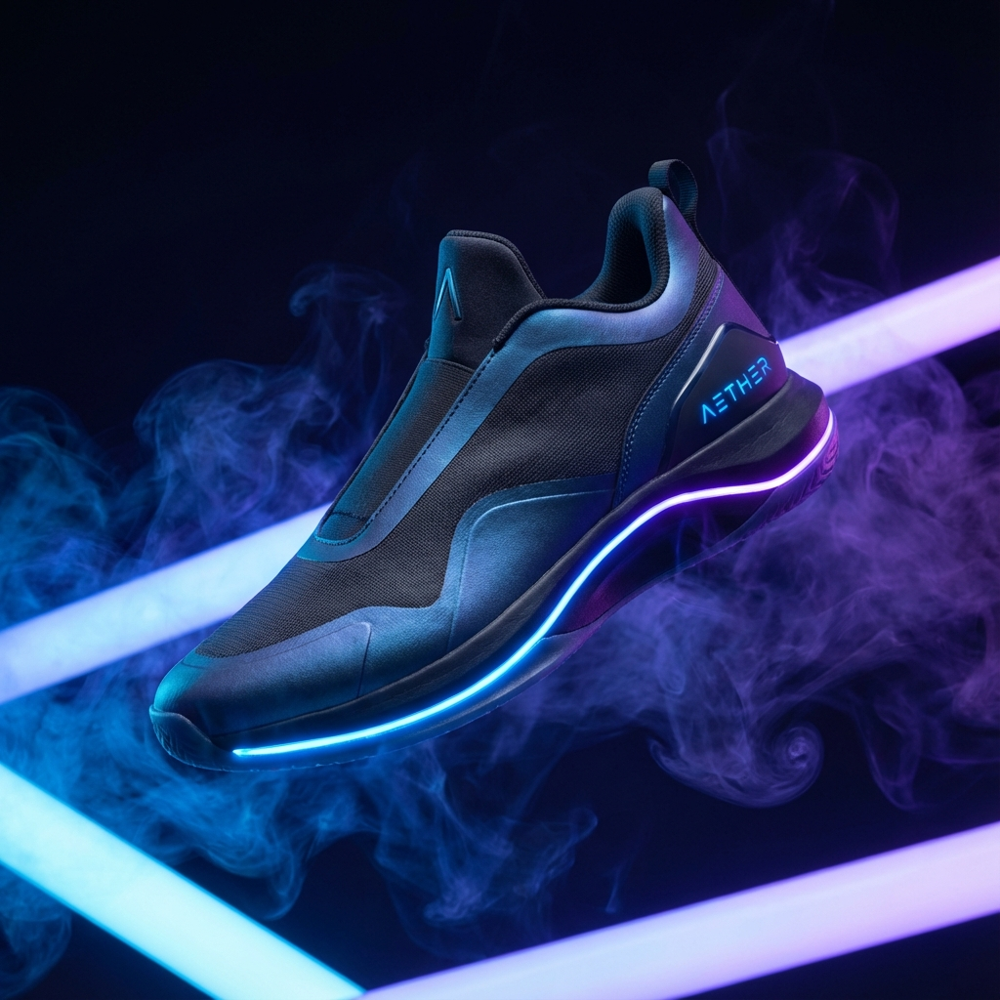

# 🌌 BuyNexa 

BuyNexa is a state-of-the-art, hyper-premium e-commerce platform designed for elite footwear. Built on **Django 5.x**, it features a cinematic "Midnight & Neon" design system, AI-generated commercial assets, and a highly optimized user journey.



## ✨ Experimental UI/UX: The "Midnight" Overhaul

BuyNexa has been completely re-engineered with a focus on visual excellence and premium interactions:

- **Midnight & Neon Aesthetics**: A deep indigo and midnight-black palette accented by electric violet neon glows.
- **Floating Glassmorphism**: A futuristic, centered navigation bar using real-time backdrop-blur technology.
- **Cinematic Motion**: Custom Cubic-Bezier transitions and "Blur-to-Focus" reveal animations for every page.
- **AI-Enhanced Catalog**: Integrated hyper-realistic commercial photography generated via advanced AI models.
- **Neo-Minimalist Layouts**: Clean "Manifest-style" order cards and spacious high-contrast product spec sheets.

## 🚀 Core Features

- **🌐 Elite Catalog**: Interactive product discovery with glow-border transition containers.
- **🛍️ The Archive (Cart)**: Comprehensive selection management with glassmorphism row items.
- **🔐 Secure Authentication**: Multi-channel auth including Google Social Login and secure local credentials.
- **🏦 Logistics & Finance Hub**: Futuristic multi-step checkout with encrypted-vault payment simulation.
- **🛠️ Command Center**: A full-featured staff dashboard for inventory control and product releases.
- **📦 Acquisition History**: High-end order tracking with premium status indicators and acquisition manifests.

## 🛠️ Technology Stack

| Layer | Technologies |
| :--- | :--- |
| **Backend** | Python 3.x, Django 5.2+ |
| **Database** | SQLite3 (Persistent storage) |
| **Auth** | Django-Allauth (Local + Google Provider) |
| **UI System** | Vanilla CSS3 (Custom Design System), HTML5 |
| **Typography** | Outfit (Headers), Inter (Body) |
| **Imaging** | Pillow, AI-Generated Assets |

## 📁 Elite Project Structure

```text
online website/
├── src/
│   ├── BuyNexa/          # Core Project Configuration
│   ├── store/           # Application Logic (Models, Views, Forms)
│   ├── static/          # Assets, Custom Design System
│   │   └── images/      # AI-Generated Commercial Photography
│   └── templates/       # Premium HTML Blueprints
├── .gitignore           # Version Control Exclusion
└── requirements.txt     # Dependency Manifest
```

## ⚙️ Deployment & Initialization

1. **Clone the Repository**:
   ```bash
   git clone https://github.com/anusha-anuak/website.git
   cd website
   ```

2. **Initialize Environment**:
   ```bash
   python -m venv venv
   # Windows:
   venv\Scripts\activate
   # Linux/macOS:
   source venv/bin/activate
   ```

3. **Install Dependencies**:
   ```bash
   pip install -r requirements.txt
   ```

4. **Initialize Database & Assets**:
   ```bash
   python manage.py migrate
   python src/setup_data.py        # Seed the elite catalog
   python src/setup_social_app.py  # Initialize social auth gateways
   ```

5. **Engage Development Server**:
   ```bash
   python manage.py runserver
   ```
   Access the experience at `http://127.0.0.1:8000/`.

## 🛡️ Administrative Access
Enter the command center at `/admin/` or access the front-end dashboard as a staff user. Default superuser credentials (if using `setup_data.py`):
- **Username**: `admin`
- **Password**: `admin`

---
*Developed with ❤️ by [Anusha](https://github.com/anusha-anuak)*
